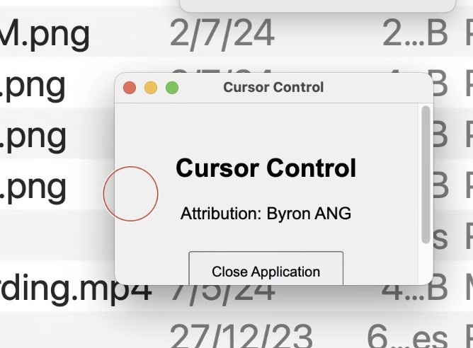

## Quickstart Guide
To start the application in windows,
do `npm start`

To build an executable for windows, 
do `npm run build`

To build an executable for mac,
do `npm run build:mac`

## About the Project

At my job, we frequently RDP into approved machines and pair program. Since the cursor is not visible to the passenger, it becomes harder to follow. This is a program I created in a quick and dirty way to get something that works.

This is how it looks in action:

